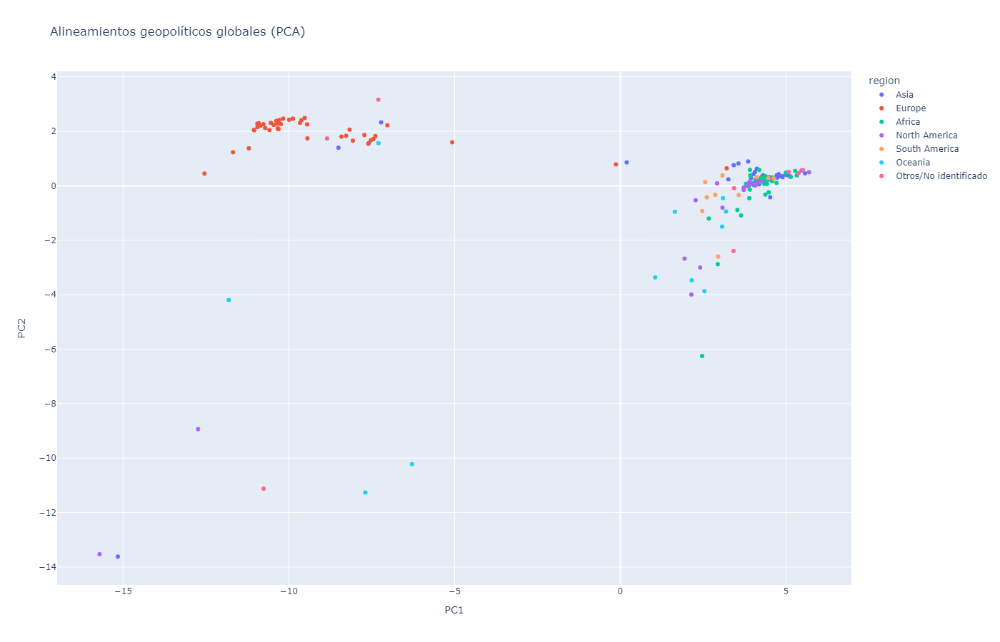
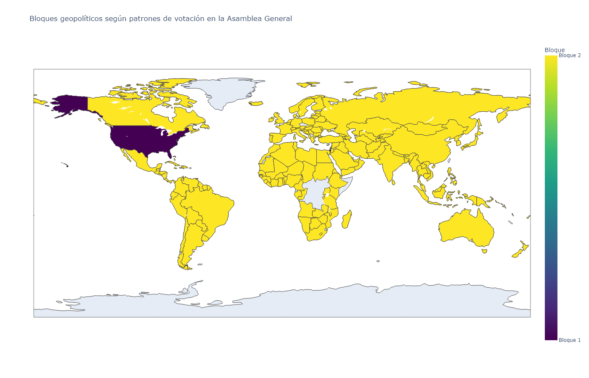

# 🏛️ Alineamientos Geopolíticos en Naciones Unidas (2010–2024)  
**Clustering no supervisado con datos de votaciones de la Asamblea General**

🌐 Disponible también en inglés: [README_EN.md](README_EN.md)

Este proyecto analiza los **patrones de votación de los Estados miembros de la ONU** entre **2010 y 2024**, con el objetivo de identificar **bloques geopolíticos** y **alineamientos internacionales** en el sistema multilateral contemporáneo.

A partir de los registros de votación de la **Asamblea General de Naciones Unidas**, se aplican técnicas de **aprendizaje no supervisado** para descubrir agrupamientos de países con comportamientos diplomáticos similares.

---

## 🧰 Stack Tecnológico
- **Lenguaje:** Python 3.10.19  
- **Librerías principales:**  
  `pandas`, `numpy`, `scikit-learn`,  
  `matplotlib`, `seaborn`, `plotly`, `pycountry`, `pycountry-convert`, `kaleido`
- **Data:** *UN General Assembly Voting Data* — [Kaggle Dataset](https://www.kaggle.com/datasets/guybarash/un-resolutions)

---

## 📊 Flujo de trabajo reproducible

1️⃣ Limpieza y transformación de votos (`Yes`=1, `Abstain`=0.5, `No`=0)  
2️⃣ Imputación de valores faltantes y generación de la matriz país–resolución  
3️⃣ **Cosine Similarity** → medición de cercanía diplomática  
4️⃣ **PCA** → reducción de dimensionalidad y visualización 2D  
5️⃣ **Clustering jerárquico (distancia coseno)** → detección de bloques geopolíticos  
6️⃣ Visualización global (PCA, dendrograma y mapa interactivo)  
7️⃣ Exportación del dataset consolidado ✅

---

## 📈 Resultados principales

### 🔹 Validación de estructura
El modelo muestra un **índice de Silhouette de 0.81**, lo que refleja una **clara separación** entre los bloques geopolíticos identificados.

### 🔹 Bloques geopolíticos principales
| Bloque | Descripción general |
|:------:|----------------------|
| 🟣 **Bloque 1** | Estados Unidos e Israel — patrón de voto distintivo y consistente en temas de seguridad y Medio Oriente. |
| 🟡 **Bloque 2** | Mayoría de los Estados miembros — comportamiento alineado con el consenso multilateral y variaciones regionales moderadas. |

---

## 🌍 Visualizaciones

### 🔹 PCA por región geográfica  
  
🔗 [Ver mapa interactivo](https://fernandezelias.github.io/UN_Voting_Clustering/figures/pca_regiones_un_2010_2024.html)

### 🔹 Bloques geopolíticos globales  
  
🔗 [Ver mapa interactivo](https://fernandezelias.github.io/UN_Voting_Clustering/figures/mapa_bloques_un_2010_2024.html)

---

## 📁 Dataset final
✔ `data/processed/un_voting_clusters_2010_2024.csv`  
Incluye: país · región · PC1-PC2 · bloque asignado ✅

---

## 🚀 Próximos pasos
- Extender el análisis al período **1990–2024** para capturar evolución de alineamientos.  
- Explorar **modelos alternativos** (DBSCAN, Affinity Propagation).  
- Integrar metadatos de resoluciones (temas, comisiones, agenda).  
- Relacionar los bloques detectados con **alianzas internacionales reconocidas** (OTAN, BRICS, G77, UE).

---

## ✍️ Autor
**Elías Fernández**  
📧 Contacto: fernandezelias86@gmail.com  
🔗 LinkedIn: www.linkedin.com/in/eliasfernandez208  

---

📌 Licencia: **MIT**